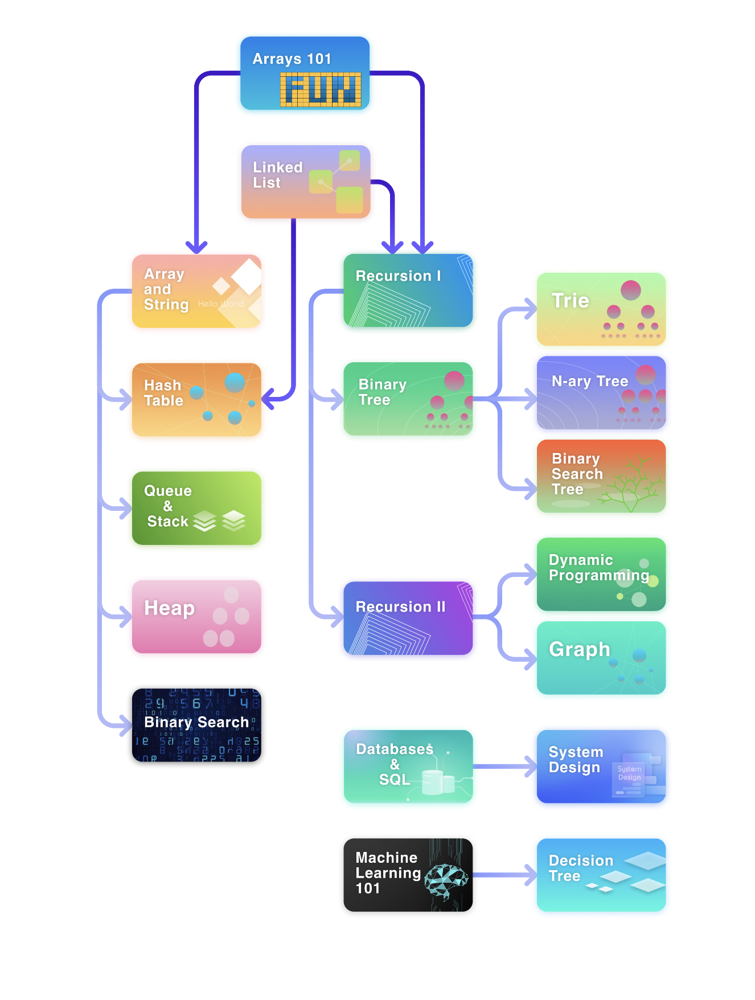

## Coding Interview Prep:
Coding interviews are different from the day-to-day work. You won't be able to bring your fancy IDE, and you will be expected to come up with a solution with a limited amount of time.

They are designed to test your problem-solving skills, algorithmic knowledge, and coding skills under pressure. so it's important to have these skills sharp and ready.

I remember doing this mistake multiple times before, where I will be busy working with a company for few years and when I decide to look for a new job, I end up spending a lot of time preparing for it after embarrassing myself in a few interviews in front of some junior developers.

So moving forward i learned my lesson to have a minimal weekly practice to keep this skillset sharp and ready.

> ### Maintenance is easier than starting from scratch.

Building the knowledge:

### The Basics: 
First thing first, you need to have a good understanding of the basics (Algorithm, and Data Structures).
I like to follow LeetCode Roadmap when studying these basics:

* Phase 1:
  * Arrays 101: https://leetcode.com/explore/learn/card/fun-with-arrays/
  * Linked List: https://leetcode.com/explore/learn/card/linked-list/
* Phase 2: 
  * Arrays and Strings: https://leetcode.com/explore/learn/card/array-and-string/
  * Queue and Stack: https://leetcode.com/explore/learn/card/queue-stack/
  * Heap: https://leetcode.com/explore/learn/card/heap/
  * Binary Search: https://leetcode.com/explore/learn/card/binary-search/
  * Hash Table: https://leetcode.com/explore/learn/card/hash-table/
  * Recursion I: https://leetcode.com/explore/learn/card/recursion-i/
  * Binary Tree: https://leetcode.com/explore/learn/card/data-structure-tree/
* Phase 3:
  * Recursion II: https://leetcode.com/explore/learn/card/recursion-ii/
  * Trie: https://leetcode.com/explore/learn/card/trie/
  * N-ary Tree: https://leetcode.com/explore/learn/card/n-ary-tree/
  * Binary Search Tree: https://leetcode.com/explore/learn/card/introduction-to-data-structure-binary-search-tree/
* Phase 4:
  * Dynamic Programming: https://leetcode.com/explore/learn/card/dynamic-programming/
  * Graph: https://leetcode.com/explore/learn/card/graph/
* Phase 5:
  * Sorting: https://leetcode.com/explore/learn/card/sorting/
  * Bit Manipulation: https://leetcode.com/explore/learn/card/bit-manipulation/

### The Practice:
After mastering the basics, you need to start practicing. I really liked the idea of this [article](https://interviewnoodle.com/top-leetcode-patterns-for-faang-coding-interviews-bdbe8766534c) where it mentions focusing on the most common patterns that are used in coding interviews.

I found two resources that where helpful to practice these patterns:
* Grokking the coding interview Patterns in Python: https://www.educative.io/courses/grokking-coding-interview-patterns-python
* A hand picked 200 problems from AlgoExpert: https://www.algoexpert.io/questions

Maintaining this knowledge:

To make maintenance easy:
* Block a time on your calendar to practice weekly
* Subscribe to a platform that has periodic contests to save yourself the time of searching for problems to solve.
  * LeetCode: https://leetcode.com/contest they have weekly and bi-weekly contests.
  * Advent of Code: https://adventofcode.com/ Every December has a series of puzzles increase in difficulty from day 1 to 25.

